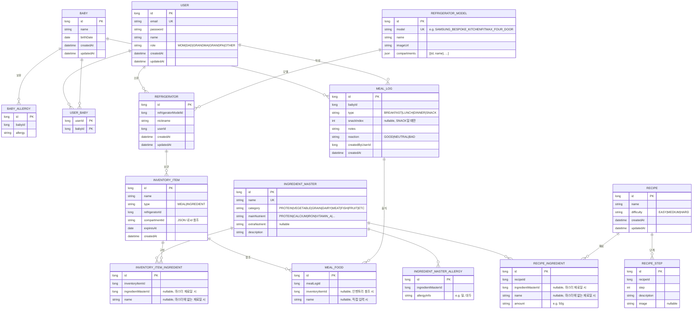

# GrowMeal ERD



## 참고사항

### Compartments (냉장고 칸)
- `REFRIGERATOR_MODEL.compartments` JSON 예시:
```json
[
  {"id": "00101", "name": "냉장 좌측 1단"},
  {"id": "00102", "name": "냉장 좌측 2단"},
  {"id": "00201", "name": "냉동 상단"}
]
```
- `INVENTORY_ITEM.compartmentId`는 해당 JSON 내의 `id`를 문자열로 저장

### Nullable 제약조건
- `INVENTORY_ITEM_INGREDIENT`: `ingredientMasterId` 또는 `name` 중 하나는 필수
- `RECIPE_INGREDIENT`: `ingredientMasterId` 또는 `name` 중 하나는 필수
- `MEAL_FOOD`: `inventoryItemId` 또는 `name` 중 하나는 필수
