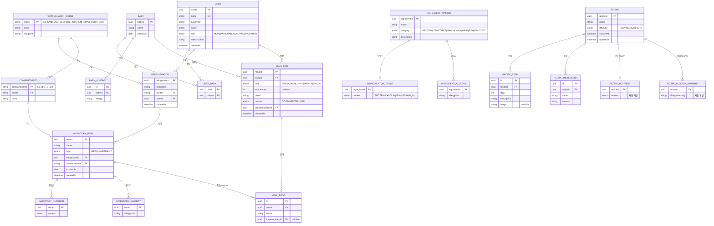

# GrowMeal ERD

```mermaid
erDiagram
    USER {
        uuid userId PK
        string email UK
        string password
        string name
        enum role "MOM|DAD|GRANDMA|GRANDPA|OTHER"
        string refreshToken
        datetime createdAt
    }

    BABY {
        uuid babyId PK
        string name
        date birthDate
    }

    BABY_ALLERGY {
        uuid id PK
        uuid babyId FK
        string allergy
    }

    USER_BABY {
        uuid userId FK
        uuid babyId FK
    }

    REFRIGERATOR_MODEL {
        string model PK "e.g. SAMSUNG_BESPOKE_KITCHENFITMAX_FOUR_DOOR"
        string name
        string imageUrl
    }

    REFRIGERATOR {
        uuid refrigeratorId PK
        string nickname
        string model FK
        uuid userId FK
        datetime createdAt
    }

    COMPARTMENT {
        string compartmentId PK "e.g. 냉장_좌_2단"
        string model FK
        string name
    }

    INGREDIENT_MASTER {
        uuid ingredientId PK
        string name
        enum category "PROTEIN|VEGETABLE|GRAIN|DAIRY|MEAT|FISH|FRUIT|ETC"
        string description
    }

    INGREDIENT_NUTRIENT {
        uuid ingredientId FK
        enum nutrient "PROTEIN|CALCIUM|IRON|VITAMIN_A|..."
    }

    INGREDIENT_ALLERGY {
        uuid ingredientId FK
        string allergyInfo
    }

    INVENTORY_ITEM {
        uuid itemId PK
        string name
        enum type "MEAL|INGREDIENT"
        uuid refrigeratorId FK
        string compartmentId FK
        date expiresAt
        datetime createdAt
    }

    INVENTORY_NUTRIENT {
        uuid itemId FK
        enum nutrient
    }

    INVENTORY_ALLERGY {
        uuid itemId FK
        string allergyInfo
    }

    RECIPE {
        uuid recipeId PK
        string name
        enum difficulty "EASY|MEDIUM|HARD"
        datetime createdAt
        datetime updatedAt
    }

    RECIPE_STEP {
        uuid id PK
        uuid recipeId FK
        int step
        string description
        string image "nullable"
    }

    RECIPE_INGREDIENT {
        uuid id PK
        uuid recipeId FK
        string name
        string amount
    }

    RECIPE_NUTRIENT {
        uuid recipeId FK
        enum nutrient "자동 계산"
    }

    RECIPE_ALLERGY_WARNING {
        uuid recipeId FK
        string allergyWarning "자동 계산"
    }

    MEAL_LOG {
        uuid mealId PK
        uuid babyId FK
        enum type "BREAKFAST|LUNCH|DINNER|SNACK"
        int snackIndex "nullable"
        string notes
        enum reaction "GOOD|NEUTRAL|BAD"
        uuid createdByUserId FK
        datetime createdAt
    }

    MEAL_FOOD {
        uuid id PK
        uuid mealId FK
        string name
        uuid inventoryItemId FK "nullable"
    }

    %% 관계
    USER ||--o{ USER_BABY : "참여"
    BABY ||--o{ USER_BABY : "공유"
    BABY ||--o{ BABY_ALLERGY : "보유"
    BABY ||--o{ MEAL_LOG : "기록됨"

    USER ||--o{ REFRIGERATOR : "소유"
    REFRIGERATOR_MODEL ||--o{ REFRIGERATOR : "모델"
    REFRIGERATOR_MODEL ||--o{ COMPARTMENT : "구성"
    REFRIGERATOR ||--o{ INVENTORY_ITEM : "보관"
    COMPARTMENT ||--o{ INVENTORY_ITEM : "위치"

    INGREDIENT_MASTER ||--o{ INGREDIENT_NUTRIENT : "영양소"
    INGREDIENT_MASTER ||--o{ INGREDIENT_ALLERGY : "알러지"
    INVENTORY_ITEM ||--o{ INVENTORY_NUTRIENT : "영양소"
    INVENTORY_ITEM ||--o{ INVENTORY_ALLERGY : "알러지"

    RECIPE ||--o{ RECIPE_STEP : "단계"
    RECIPE ||--o{ RECIPE_INGREDIENT : "재료"
    RECIPE ||--o{ RECIPE_NUTRIENT : "영양소(자동)"
    RECIPE ||--o{ RECIPE_ALLERGY_WARNING : "알러지(자동)"

    MEAL_LOG ||--o{ MEAL_FOOD : "음식"
    INVENTORY_ITEM ||--o{ MEAL_FOOD : "참조(optional)"
    USER ||--o{ MEAL_LOG : "작성"
```
